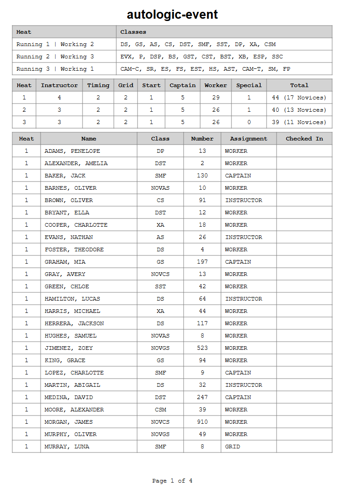

# Autologic

This program generates heat + worker assignments for autocross events.

It provides a framework that may be used to assign `Categories` (car classes) to `Heats`, and `Participants` to `Roles` (specialized work assignments).

The default algorithm loads an `Event`, randomly assigns `Categories` to `Heats`, checks against acceptance criteria (can all `Roles` be filled within each `Heat`; do all `Heats` contain a similar number of `Participants`; are Novices evenly distributed across `Heats`; etc.), and keeps iterating until all criteria are met.

> [!NOTE]
> **This is a minimum viable prototype product.** The main code is untested spaghetti. The documentation is simply this README file. It will be cleaned and made more generally applicable after it's gained some field experience at actual events.

All names found in the sample files and documentation within this repository are fictional and have been randomly generated.

## Retrieval and usage

1. Download `autologic.exe` from the latest release on the [releases page](https://github.com/joshuavictorchen/autologic/releases/).

2. Open a terminal window and execute `.\path\to\autologic.exe --config .\path\to\config_file.yaml` to generate heat and worker assignments for a set of configured parameters.

### Notes

- See [sample_event_config.yaml](./tests/sample_event_config.yaml) for an example of a configuration file.
  - See [sample_axware_export.tsv](./tests/sample_axware_export.tsv) (pulled from AXWare) and [sample_member_attributes.csv](./tests/sample_member_attributes.csv) (maintained by worker coordinators) for examples of the expected input data structures.

- The dictionary of roles and their minimum requirements per heat is semi-hardcoded in [utils.py](./source/utils.py)'s `roles_and_minima` definition:
  - The minimum number of instructors in a heat is equal to `number_of_novices` divided `novice_denominator`, or `MIN_INSTRUCTOR_PER_HEAT`, whichever is greater.
  - The minimum number of corner captains in a heat is equal to `number_of_stations`.

- Heat sizes are constrained to `mean_group_size` of the `Event` +/- a `max_group_delta`, which can be tuned in the configuration file.

- Novice distribution across heats is constrained to `mean_novice_count` of the `Event` +/- a `max_novice_delta`, which can be tuned in the configuration file.

## Sample PDF output



## Sample execution

```powershell
(autologic) PS C:\codes\autologic> .\dist\autologic.exe --config .\dist\sample_event_config.yaml

  Role minimums
  -------------
  instructor: 16 / 9
      timing: 26 / 6
        grid: 31 / 6
       start: 24 / 3
     captain: 26 / 15

  ==================================================

  [Iteration 0]

  Heat size must be 41 +/- 5
  Novice count must be 14 +/- 5

  Heat 1 rejected: novice count of 8

  ==================================================

  [Iteration 1]

  Heat size must be 41 +/- 5
  Novice count must be 14 +/- 5

  Heat 1 (45 total, 16 novices)
  -----------------------------

    Car classes: [EVX, P, SR, DSP, ES, EST, CST, CS, CAM-T, XB]

    8 of 4 instructors required
    8 of 2 timings required
    12 of 2 grids required
    11 of 1 starts required
    9 of 5 captains required

    Taylor, Henry       assigned to SPECIAL
    Johnson, Noah       assigned to INSTRUCTOR (custom assignment)
    Turner, Elias       assigned to INSTRUCTOR
    Patterson, Benjamin assigned to INSTRUCTOR
    Wallace, Michael    assigned to INSTRUCTOR
    Anderson, Lucas     assigned to CAPTAIN
    Reynolds, Henry     assigned to CAPTAIN
    White, Evelyn       assigned to CAPTAIN
    Gibson, Sofia       assigned to CAPTAIN
    Jordan, Charlotte   assigned to CAPTAIN
    Carter, Theodore    assigned to TIMING
    Walker, David       assigned to TIMING
    Lewis, Aiden        assigned to GRID
    Hayes, Matthew      assigned to GRID
    Gonzalez, Benjamin  assigned to START
    Griffin, Evelyn     assigned to WORKER
    Wright, Victoria    assigned to WORKER
    Jackson, Harper     assigned to WORKER
    Gutierrez, William  assigned to WORKER
    Kelly, Mia          assigned to WORKER
    Ward, Daniel        assigned to WORKER
    Stevens, Samuel     assigned to WORKER
    Fisher, Sophia      assigned to WORKER
    Miller, Elijah      assigned to WORKER
    Moreno, Abigail     assigned to WORKER
    Scott, Leo          assigned to WORKER
    Chavez, Jackson     assigned to WORKER
    Sullivan, Eleanor   assigned to WORKER
    Russell, Layla      assigned to WORKER
    Sullivan, Eleanor   assigned to WORKER
    Patel, Chloe        assigned to WORKER
    Stewart, Isaac      assigned to WORKER
    Gray, Avery         assigned to WORKER
    Morgan, James       assigned to WORKER
    Perry, Aria         assigned to WORKER
    Brown, Oliver       assigned to WORKER
    Jones, Ava          assigned to WORKER
    Foster, Theodore    assigned to WORKER
    Davis, Sophia       assigned to WORKER
    Hernandez, James    assigned to WORKER
    Hall, Joseph        assigned to WORKER
    West, Daniel        assigned to WORKER
    Cole, Emily         assigned to WORKER
    Ellis, Aiden        assigned to WORKER
    Richardson, Emily   assigned to WORKER

  Heat 2 (38 total, 13 novices)
  -----------------------------

    Car classes: [GS, FS, GST, AS, HS, AST, DST, XA, CSM, ESP]

    5 of 3 instructors required
    11 of 2 timings required
    7 of 2 grids required
    7 of 1 starts required
    8 of 5 captains required

    Cruz, Layla         assigned to INSTRUCTOR
    Evans, Nathan       assigned to INSTRUCTOR
    Phillips, Zoey      assigned to INSTRUCTOR
    Graham, Mia         assigned to CAPTAIN
    Williams, Emma      assigned to CAPTAIN
    Edwards, Eleanor    assigned to CAPTAIN
    Young, Luna         assigned to CAPTAIN
    Reed, Lucas         assigned to CAPTAIN
    Rogers, Sophia      assigned to GRID
    Gray, Avery         assigned to GRID
    Wilson, Amelia      assigned to START
    Nelson, Lily        assigned to TIMING
    Allen, Samuel       assigned to TIMING
    Murphy, Oliver      assigned to WORKER
    King, Grace         assigned to WORKER
    Jimenez, Zoey       assigned to WORKER
    Ramos, Evelyn       assigned to WORKER
    Garcia, Liam        assigned to WORKER
    Martinez, Matthew   assigned to WORKER
    Coleman, Hannah     assigned to WORKER
    Romero, James       assigned to WORKER
    Mendoza, David      assigned to WORKER
    Hughes, Samuel      assigned to WORKER
    Barnes, Oliver      assigned to WORKER
    Vasquez, William    assigned to WORKER
    Chavez, Jackson     assigned to WORKER
    Cook, Elijah        assigned to WORKER
    Aguilar, Joseph     assigned to WORKER
    Coleman, Hannah     assigned to WORKER
    Thompson, Daniel    assigned to WORKER
    Simmons, Isabella   assigned to WORKER
    Alexander, Amelia   assigned to WORKER
    Bryant, Ella        assigned to WORKER
    Medina, David       assigned to WORKER
    Cooper, Charlotte   assigned to WORKER
    Harris, Michael     assigned to WORKER
    Moore, Alexander    assigned to WORKER
    Henderson, Mia      assigned to WORKER

  Heat 3 (40 total, 12 novices)
  -----------------------------

    Car classes: [CAM-C, DS, BS, BST, SMF, SST, DP, SM, FP, SSC]

    3 of 3 instructors required
    7 of 2 timings required
    12 of 2 grids required
    6 of 1 starts required
    9 of 5 captains required

    Thomas, Mia         assigned to SPECIAL
    Hamilton, Lucas     assigned to INSTRUCTOR
    Martin, Abigail     assigned to INSTRUCTOR
    Smith, Olivia       assigned to INSTRUCTOR
    Clark, Jackson      assigned to CAPTAIN    (custom assignment)
    Robinson, Ella      assigned to CAPTAIN
    Myers, Penelope     assigned to CAPTAIN
    Hughes, Samuel      assigned to CAPTAIN
    Alvarez, Grace      assigned to CAPTAIN
    Howard, Henry       assigned to TIMING
    Green, Chloe        assigned to TIMING
    Tran, Avery         assigned to START
    Reyes, Hannah       assigned to GRID
    Ramos, Evelyn       assigned to GRID
    Bailey, Amelia      assigned to WORKER
    Jenkins, Elias      assigned to WORKER
    Morris, Mia         assigned to WORKER
    Long, Jack          assigned to WORKER
    Foster, Theodore    assigned to WORKER
    Peterson, Benjamin  assigned to WORKER
    Watson, Matthew     assigned to WORKER
    Herrera, Jackson    assigned to WORKER
    Ruiz, Joseph        assigned to WORKER
    Brooks, Ella        assigned to WORKER
    Martinez, Isabella  assigned to WORKER
    Turner, Elias       assigned to WORKER
    Powell, Nathan      assigned to WORKER
    Castillo, Victoria  assigned to WORKER
    Miller, Elijah      assigned to WORKER
    Cox, Abigail        assigned to WORKER
    Garcia, Emily       assigned to WORKER
    Rodriguez, Sofia    assigned to WORKER
    Lopez, Charlotte    assigned to WORKER
    Baker, Jack         assigned to WORKER
    Murray, Luna        assigned to WORKER
    Adams, Penelope     assigned to WORKER
    Rodriguez, William  assigned to WORKER
    Stewart, Isaac      assigned to WORKER
    Ortiz, Isabella     assigned to WORKER
    Ford, Grace         assigned to WORKER

  ---

  >>> Iteration 1 accepted <<<

  The following individuals have not checked in and are therefore excluded:

  - Simmons, Isabella
  - Parker, Aria
  - Castillo, Victoria

  Worker assignment sheet saved to autologic-export.csv

  Worker assignment printout saved to autologic-export.pdf
```
